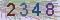
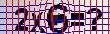

<h1 align="center">CAPTCHA-CV-OCR</h1>

<p align="center"><b>使用 CV (OpenCV) 和 OCR (Tesseract) 进行验证码识别</b></p>

simplest | grids_and_equations | dots_and_chars | slide_match | ...
:-: | :-: | :-: | :-: | :-:
 |  |  | - | ...
2348 | 2x6=? | 7RVO | 滑块匹配 | ...

## 快速入门

### 安装

```bash
# use npm, yarn or pnpm
npm add captcha-cv-ocr
```

因为所需的 OpenCV 支持模块 [@u4/opencv4nodejs](https://github.com/UrielCh/opencv4nodejs) 体积较大，编译过程复杂，请手动安装，或者参考官方的安装指南：

```bash
npm i @u4/opencv4nodejs -g
```

### 用法

```javascript
const path = require("path");
const { Cvocr, getCodesList } = require("captcha-cv-ocr");

var mode = "simplest";

(async () => {
    let cvocr = new Cvocr(mode);  // mode 表示验证码的种类
    await cvocr.init(1);  //其中的1表示需要启动的 OCR Worker 数（多线程）
    let ans = await cvocr.recognize(path.join(__dirname, "docs/img", mode + ".jpg"));  //支持文件地址、Base64、Buffer形式
    console.log("ans:", ans)
    process.exit(0);
})()
```

### 说明

第三种验证码(`dots_and_chars`)识别改为用 [sharp](https://github.com/lovell/sharp) 和纯 JavaScript 的 CV 算法来实现，方便在树莓派上运行，但效率相比前两者很低。

## 开发

```bash
git clone https://github.com/renxia/captcha-cv-ocr
cd captcha-cv-ocr
npm install
# 约等于安装为全局模块
npm link            
```

### 测试

```bash
npm test
```

### 已支持

simplest | grids_and_equations | dots_and_chars
:-: | :-: | :-:
 |  | 
2348 | 2x6=? | 7RVO

### 新支持

codes下的文件夹对应着不同种类的名字（自行命名），你可以参照已有的模板与API创建新的识别库，来适配其他各种验证码。

### 参考文档与额外说明

- opencv4nodejs
    - Github | https://github.com/justadudewhohacks/opencv4nodejs
    - API | https://justadudewhohacks.github.io/opencv4nodejs/docs/Mat/
- @u4/opencv4nodejs
    - https://github.com/UrielCh/opencv4nodejs
- tesseract.js
    - 主页 | https://tesseract.projectnaptha.com/
    - Github | https://github.com/naptha/tesseract.js
    - API | https://github.com/naptha/tesseract.js#docs
    - 第三种验证码如果进行训练识别效果会更好
- sharp
    - Github | https://github.com/lovell/sharp
    - API | https://sharp.pixelplumbing.com/api-constructor
    - 另外吐槽：只有编辑图像的基础功能，而且体验不是很理想需要绕过bug
- ./lib/fakeOpenCV
    - 个人仿照 OpenCV 重写了一些图像算法

C++ / Python 的 OpenCV 海量资料也非常有帮助， 相应的函数基本都能在 [opencv4nodejs 的 API 文档](https://justadudewhohacks.github.io/opencv4nodejs/docs/Mat/) 里找到。
